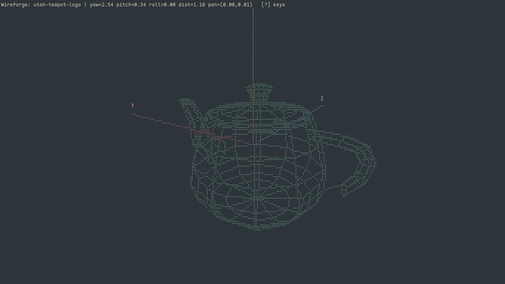

# Wireforge

[](https://crates.io/crates/wireforge)

A text format, a parser, a Unix-style CLI, and a terminal viewer.



## Overview

`.wrfm` is a 3D model format containing a set of points and the lines between
them. The file opens with a magic line (`wrfm 2`) and a counts header, then
`v <x> <y> <z>` lines for the points and `e <a> <b>` lines for the lines. `#`
starts a comment; named groups are optional. A tetrahedron fits in twenty
lines.

Because it is plain text, the ordinary tools already work on it. Your editor
edits it, `diff` shows what changed, a pipe carries it, and a whole model fits
in a code review.

Wireforge is a small set of tools arranged around that format:

- **`.wrfm`** — the format itself (v2; the v1 files of `wrfm` 0.4.0 are not
  read).
- **[`wrfm`](crates/wrfm)** — a zero-dependency Rust library that parses and
  serializes it, with `no_std` support and exact `f64` round-trips.
- **[`wrfm` CLI](crates/wrfm-cli)** — thirteen subcommands that check, verify,
  inspect, query, transform, edit, render and diff models over plain stdio.
- **[`wrfm-raster`](crates/wrfm-raster)** — the shared renderer: camera
  projection and braille rasterization used by both the CLI and the viewer,
  byte-identical to ratatui's canvas.
- **`wireforge`** — the viewer. Open a file and turn it around with the
  keyboard; run it with no file and the empty space still comes up, XYZ axes
  and all.

Each part works on its own.

## Features

- **Content, not extensions.** The viewer sniffs what it is given: a model in
  a `.txt` opens as a model, an OBJ file is pointed at `wrfm convert`, and a
  broken model fails with the parser's line-and-column report on stderr.
- **The camera is your keyboard.** Rotate, pan and zoom with `hjkl`, the arrow
  keys, and a few more; `Ctrl` turns the model around its own axes instead of
  the world's; `Shift + f` frames whatever is in the file. A HUD line always
  tells you where you are, and `?` shows every binding.
- **Everything is a pipe.** The viewer reads stdin (`wireforge -`), and the CLI
  never touches the disk, so the whole toolchain composes the way you would
  expect:

  ```bash
  wrfm convert mouse.obj | wireforge -
  wrfm edit model.wrfm --extract-group cabinet | wrfm transform - --scale 2 | wireforge -
  ```

- **It is light.** Rendering runs on the CPU only, drawing braille cells, with
  no GPU, no GUI toolkit, and no display server. The event loop sleeps when
  nothing changes and redraws at full speed while you animate. Projection and
  rasterization switch to parallel (rayon) paths on large models.
- **Built for scripts.** Data goes to stdout, diagnostics go to stderr, and the
  exit code tells you how things are, whether ok, warn, or broken. A CI job can
  assert on a model the same way it asserts on a test suite.

## Getting started

```bash
cargo install wireforge
```

It is also on the [AUR](https://aur.archlinux.org/packages/wireforge), and can
be built from source with `cargo build --release`. [SPEC.md](SPEC.md) walks
through installation, the viewer, its key bindings, and the format itself.

## Documentation

[SPEC.md](SPEC.md) — installation, viewer usage, the full key table, and the
`.wrfm` format.

[crates/wrfm-cli/README.md](crates/wrfm-cli/README.md) — the complete CLI
reference, covering every subcommand, recipe, and exit-code contract.

[crates/wrfm/README.md](crates/wrfm/README.md) — using the parser library and
the authoritative prose specification of the format.

[CHANGELOG.md](CHANGELOG.md) — release history.

## License

[MIT](LICENSE)
